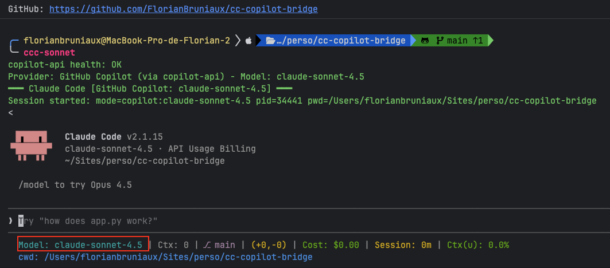
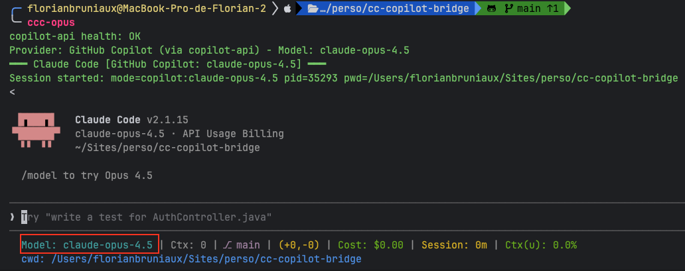
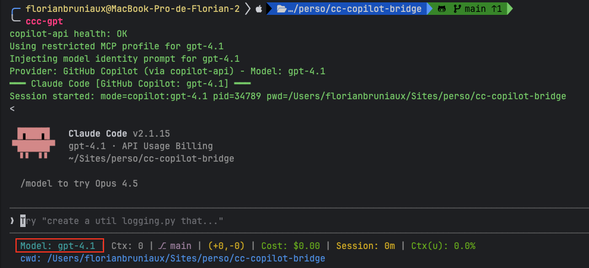
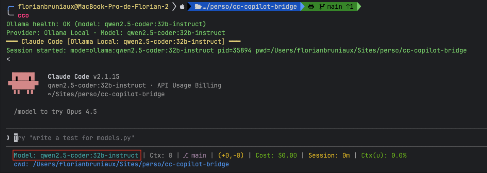
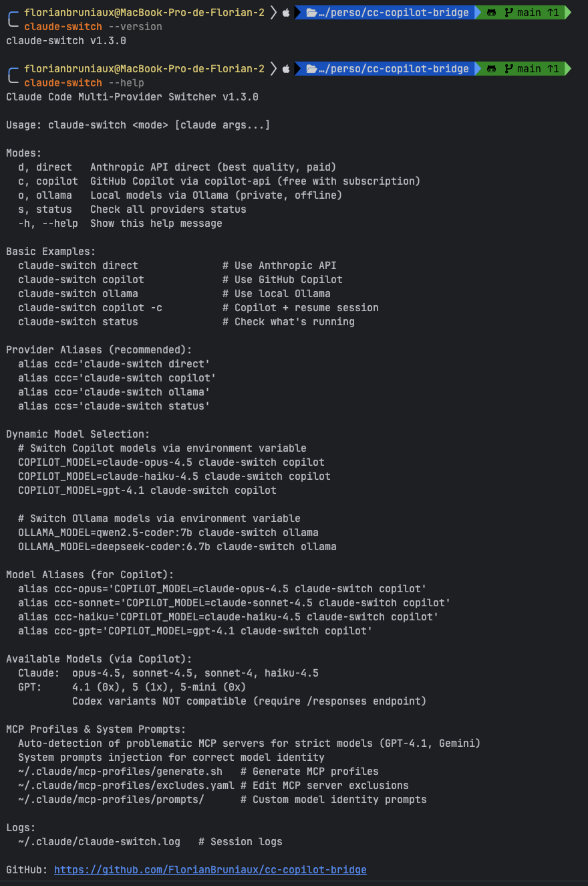
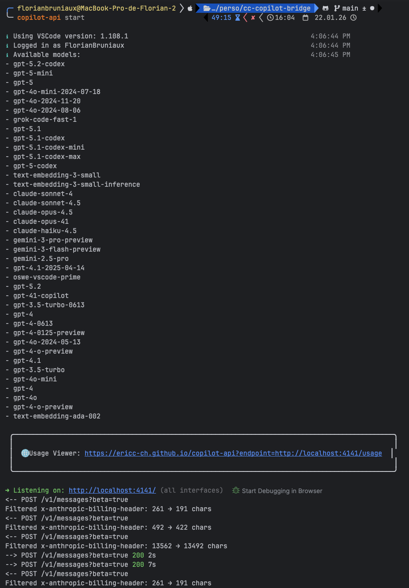

# cc-copilot-bridge

> **TL;DR**: Bash script that routes Claude Code CLI through different AI providers. Use your existing Copilot Pro+ subscription to access Claude/GPT/Gemini models, or run 100% offline with Ollama. Three aliases (`ccc`, `cco`, `ccd`) switch between providers instantly.

<div align="center">

[](https://opensource.org/licenses/MIT)
[](https://github.com/FlorianBruniaux/cc-copilot-bridge/releases)
[]()
[](https://www.gnu.org/software/bash/)

**Turn your $10/month GitHub Copilot Pro+ into unlimited Claude Code CLI access**

99.3% cost savings vs Anthropic Direct API. Unlimited AI coding for $10/month (flat rate). Access 25+ models: GPT-4.1, Claude Opus/Sonnet/Haiku, Gemini, and more.

[Quick Start](#-quick-start) • [Features](#-features) • [Documentation](docs/) • [Troubleshooting](docs/TROUBLESHOOTING.md)

</div>

---

## 🎯 What Is This?

A **GitHub Copilot bridge** that transforms your existing **Copilot Pro+ subscription** ($10/month) into unlimited Claude Code CLI access with 25+ AI models.

**No additional API costs. No per-token billing. Just unlimited AI coding.**

### 💰 The Value Proposition

| Scenario | Anthropic Direct | cc-copilot-bridge | Your Savings |
|----------|------------------|-------------------|--------------|
| **100M tokens/month** | $1,500 (Haiku) | $10 (Copilot flat) | **$1,490 (99.3%)** |
| **10 sessions/day** | ~$300/month | $10/month | **$290 (96.7%)** |
| **Heavy daily usage** | Pay per token | Fixed $10/month | **~$290/month** |

**Prerequisites**: GitHub Copilot Pro+ subscription ($10/month) - *that's it*.

### 🎁 Three Providers in One Tool

✅ **CORE**: GitHub Copilot Bridge 

→ Daily development (FREE via your $10/month subscription)

✅ **BONUS**: Ollama Local 

→ Offline mode for proprietary code (100% private, no internet)

✅ **FALLBACK**: Anthropic Direct API 

→ Production-critical analysis (pay per token)

### Architecture Overview

```
┌─────────────────────────────────────────────────┐
│           Claude Code CLI                       │
│         (Anthropic's CLI tool)                  │
└─────────────────┬───────────────────────────────┘
                  │
        ┌─────────▼──────────┐
        │  cc-copilot-bridge │  ◄─── This Tool
        └─────────┬──────────┘
                  │
        ┌─────────┴────────────┌─────────────────┐
        │                      |                 │
    ┌───▼────┐         ┌───────▼────────┐   ┌───▼────┐
    │ Direct │         │ Copilot Bridge │   │ Ollama │
    │  API   │         │  (copilot-api) │   │ Local  │
    └────────┘         └────────────────┘   └────────┘
    Anthropic           GitHub Copilot       Self-hosted
    $0.015/1M tokens    $10/month (flat)     Free (offline)
    (Haiku example)     UNLIMITED usage      Apple Silicon
```

---

## 🚀 Quick Start

### Installation

**Quick start** (automated, 30 seconds):
```bash
curl -fsSL https://raw.githubusercontent.com/FlorianBruniaux/cc-copilot-bridge/main/install.sh | bash
source ~/.zshrc  # or ~/.bashrc
```

**Security-conscious?** See [Manual Installation Guide](QUICKSTART.md#option-2-manual-security-conscious---3-minutes)

**Full setup guide**: [QUICKSTART.md](QUICKSTART.md)

### Setup Aliases

```bash
# Add to ~/.bash_aliases or ~/.zshrc
alias ccd='claude-switch direct'      # Anthropic API (paid)
alias ccc='claude-switch copilot'     # GitHub Copilot (free*)
alias cco='claude-switch ollama'      # Ollama Local (offline)
alias ccs='claude-switch status'      # Check all providers

# Model shortcuts
alias ccc-gpt='COPILOT_MODEL=gpt-4.1 claude-switch copilot'
alias ccc-opus='COPILOT_MODEL=claude-opus-4.5 claude-switch copilot'
```

### Usage

```bash
# Start with Copilot (free via your subscription)
ccc

# Switch models on-the-fly
COPILOT_MODEL=gpt-4.1 ccc
COPILOT_MODEL=claude-opus-4.5 ccc

# Check status
ccs
```

**Visual Examples**:

**Claude Sonnet 4.5 (Default)**:


**Claude Opus 4.5 (Premium)**:


**GPT-4.1 (OpenAI)**:


**Ollama Offline (Private)**:


---

## 💰 Cost Comparison

| Scenario | Anthropic Direct | cc-copilot-bridge | Savings |
|----------|------------------|-------------------|---------|
| **100M tokens/month** | $1,500 (Haiku) | $10 (Copilot flat) | **99.3%** |
| **10 sessions/day** | ~$300/month | $10/month | **96.7%** |
| **Heavy usage** | Pay per token | Fixed $10/month | **~$290/month** |

**Requirements**: GitHub Copilot Pro+ subscription ($10/month)

---

## 🎨 Features

### 1. **Instant Provider Switching** (3 characters)

```bash
ccd     # Anthropic Direct API (production)
ccc     # GitHub Copilot Bridge (prototyping)
cco     # Ollama Local (offline/private)
```

No config changes, no restarts, no environment variable juggling.

**Help Menu**:


**Available commands**:
- `ccs` / `claude-switch status` - Check all providers health
- `claude-switch --help` - Full command reference

### 2. **Dynamic Model Selection** (25+ models)

| Provider | Models | Cost |
|----------|--------|------|
| **Anthropic** | opus-4.5, sonnet-4.5, haiku-4.5 | Per token |
| **Copilot** | claude-*, gpt-4.1, gpt-5, gemini-* | Flat $10/month |
| **Ollama** | qwen2.5-coder, deepseek-coder, codellama | Free |

```bash
# Switch models mid-session
ccc                     # Default: claude-sonnet-4.5
ccc-opus                # Claude Opus 4.5
ccc-gpt                 # GPT-4.1
COPILOT_MODEL=gemini-2.5-pro ccc  # Gemini
```

### 3. **MCP Profiles System** (Auto-Compatibility)

**Problem**: GPT-4.1 has strict JSON schema validation → breaks some MCP servers

**Solution**: Auto-generated profiles exclude incompatible servers

```bash
~/.claude/mcp-profiles/
├── excludes.yaml       # Define problematic servers
├── generate.sh         # Auto-generate profiles
└── generated/
    ├── gpt.json       # GPT-compatible (9/10 servers)
    └── gemini.json    # Gemini-compatible
```

### 4. **Model Identity Injection**

**Problem**: GPT-4.1 thinks it's Claude when running through Claude Code CLI

**Solution**: System prompts injection

```bash
~/.claude/mcp-profiles/prompts/
├── gpt-4.1.txt        # "You are GPT-4.1 by OpenAI..."
└── gemini.txt         # "You are Gemini by Google..."
```

**Result**: Models correctly identify themselves

### 5. **Health Checks & Fail-Fast**

```bash
ccc
# → ERROR: copilot-api not running on :4141
#    Start it with: copilot-api start
```

### 6. **Session Logging**

```bash
tail ~/.claude/claude-switch.log

[2026-01-22 09:42:33] [INFO] Provider: GitHub Copilot - Model: gpt-4.1
[2026-01-22 09:42:33] [INFO] Using restricted MCP profile for gpt-4.1
[2026-01-22 09:42:33] [INFO] Injecting model identity prompt for gpt-4.1
[2026-01-22 10:15:20] [INFO] Session ended: duration=32m47s exit=0
```

---

## 🏗️ Provider Architecture

### 🎯 CORE: GitHub Copilot Bridge

**Use Case**: Daily coding, prototyping, exploration (FREE*)

```bash
ccc                               # Default: claude-sonnet-4.5
ccc-gpt                          # GPT-4.1
ccc-opus                         # Claude Opus 4.5
COPILOT_MODEL=gemini-2.5-pro ccc # Gemini
```

**How It Works**:
- Routes through [copilot-api](https://github.com/ericc-ch/copilot-api) proxy
- **Unlimited** usage for $10/month (Copilot Pro+ subscription)
- Access to 15+ models (Claude, GPT, Gemini families)
- Best for: Daily development, experimentation, learning

**copilot-api Running**:


*Screenshot: copilot-api proxy server logs showing active connections*

**Requirements**:
1. GitHub Copilot Pro+ subscription ($10/month)
2. copilot-api running locally (`copilot-api start`)

---

### 🎁 BONUS: Ollama Local (Offline Mode)

**Use Case**: Offline work, proprietary code, air-gapped environments

```bash
cco                                          # Default: qwen2.5-coder:32b
OLLAMA_MODEL=deepseek-coder:33b cco          # DeepSeek Coder
```

**How It Works**:
- Self-hosted inference (no internet required)
- Free, 100% private
- Apple Silicon optimized (M1/M2/M3/M4 - up to 4x faster)
- Best for: Sensitive code, airplane mode, privacy-first scenarios

**Important**: Ollama is **architecturally independent** from Copilot bridging. It's a separate provider for local inference, not related to copilot-api.

**Requirements**:
1. Ollama installed (`ollama.ai`)
2. Models downloaded (`ollama pull qwen2.5-coder:32b-instruct`)

---

### 🔄 FALLBACK: Anthropic Direct API

**Use Case**: Production, maximum quality, critical analysis

```bash
ccd
```

**How It Works**:
- Official Anthropic API
- Pay per token ($0.015-$75 per 1M tokens)
- Best for: Production code review, security audits, critical decisions

**Requirements**:
1. `ANTHROPIC_API_KEY` environment variable
2. Anthropic account with billing

---

## 📊 Competitive Landscape & Tool Comparison

The Claude Code ecosystem includes 30+ routing and provider management tools. Here's how **cc-copilot-bridge** positions itself:

### 🎯 Market Segmentation

| Category | Representative Tools | Target Use Case |
|----------|---------------------|-----------------|
| **Configuration Switchers** | jiang6641/claude-switch, foreveryh/claude-code-switch | Manual profile switching |
| **Multi-Provider Proxies** | @musistudio/claude-code-router (31.9k/week), fuergaosi233/claude-code-proxy | API routing & aggregation |
| **Copilot Bridges** | **cc-copilot-bridge** (this project) | Free access via Copilot Pro+ |
| **Orchestration Frameworks** | ruvnet/claude-flow, coder/anyclaude | Multi-agent systems |
| **Desktop Apps** | farion1231/cc-switch (Rust GUI) | Cross-platform GUI management |
| **Open-Source Alternatives** | OpenCode (48k stars) | Complete Claude Code replacement |

### 🥊 Head-to-Head Comparison (Top Tools)

| Feature | **cc-copilot-bridge** | @musistudio/router | fuergaosi233/proxy | OpenCode |
|---------|----------------------|-------------------|-------------------|----------|
| **Weekly Downloads** | N/A (new) | **31,917** 🏆 | Unknown | 48,000 stars |
| **Architecture** | Copilot proxy | Multi-provider API router | OpenAI-compatible proxy | Full IDE replacement |
| **Cost Model** | **$10/month flat** 💰 | Per-token ($0.14-$75/1M) | Per-token | Free (self-hosted) |
| **Copilot Integration** | ✅ **Primary feature** | ❌ Not supported | ❌ Not supported | ❌ Not supported |
| **Providers Supported** | 3 (Direct, Copilot, Ollama) | 8+ native | OpenAI-compatible only | 75+ providers |
| **Offline Mode** | ✅ Ollama provider | ❌ Cloud only | ❌ Cloud only | ✅ Local models |
| **MCP Profiles** | ✅ Auto-generated | ✅ Manual config | ❌ None | N/A |
| **Model Identity** | ✅ Injected prompts | ❌ N/A | ❌ N/A | N/A |
| **Web UI** | ❌ CLI only | ✅ Full React UI | ❌ CLI only | ✅ Full IDE |
| **Setup Complexity** | ⚡ 1 command | 🔧 Medium (config.json) | ⚡ Simple (.env) | 🔧 Complex |
| **GitHub Actions** | ❌ Not supported | ✅ Native integration | ❌ Not supported | ✅ Workflows |
| **Target Audience** | **Copilot Pro+ subscribers** | API users, enterprises | OpenAI-centric teams | Open-source purists |
| **Best For** | **Unlimited coding for $10/month** | Production routing at scale | Simple OpenAI fallback | Full IDE replacement |

### 🎯 Unique Value Propositions

| Tool | Core USP | When to Choose |
|------|----------|----------------|
| **cc-copilot-bridge** | **Turn $10 Copilot → unlimited Claude Code** | You have Copilot Pro+, want free access |
| @musistudio/router | Market leader (31.9k/week), mature ecosystem | Production-grade multi-provider routing |
| fuergaosi233/proxy | Python-based, minimal setup | Python stack, OpenAI fallback only |
| 1rgs/proxy | LiteLLM integration (100+ providers) | Maximum provider coverage |
| horselock/proxy | OAuth PKCE (account-based auth) | No API key dependency |
| glidea/worker-proxy | Edge deployment (Cloudflare Workers) | Ultra-low latency, global distribution |
| ruvnet/claude-flow | 54 agents, neural learning, persistence | Enterprise orchestration, multi-agent |
| farion1231/cc-switch | Rust desktop GUI (macOS/Linux/Windows) | Non-technical users, visual config |
| OpenCode | 75+ providers, open-source | Complete open-source alternative |

### 💡 Why cc-copilot-bridge Exists

**Serving Copilot Pro+ subscribers specifically.**

For general multi-provider routing at scale, see [@musistudio/claude-code-router](https://www.npmjs.com/package/@musistudio/claude-code-router) (31.9k weekly downloads).

| Dimension | cc-copilot-bridge | Other Tools |
|-----------|-------------------|-------------|
| **Primary Value** | Leverage existing $10/month Copilot subscription | Route to multiple paid APIs |
| **Cost Structure** | Flat $10/month (unlimited usage) | Per-token billing |
| **Prerequisites** | GitHub Copilot Pro+ subscription | API keys from multiple providers |
| **Use Case** | Daily development, prototyping, learning | Production routing, cost optimization |
| **Philosophy** | "You already pay for Copilot, use it with Claude Code" | "Route to best API for each task" |

### 🏆 Market Insights

**Market Leaders by Adoption**:
1. **@musistudio/claude-code-router** - 31,917 weekly downloads (proxy category winner)
2. **OpenCode** - 48,000 GitHub stars (open-source category winner)
3. **fuergaosi233/claude-code-proxy** - 1,600 GitHub stars (Python category winner)

**Market Distribution**:
- **Configuration Switchers**: <5% adoption (legacy approach)
- **Multi-Provider Proxies**: 95%+ adoption (current standard)
- **Orchestration Frameworks**: <1% but fastest-growing (enterprise future)

**Technology Stack Preferences**:
- TypeScript/Node.js: 60% of tools (musistudio, 1rgs, etc.)
- Python: 25% of tools (fuergaosi233, ujisati)
- Rust: 10% (farion1231 desktop app)
- Go/Hybrid: 5% (jimmc414)

### 🚀 Differentiation Strategy

**cc-copilot-bridge differentiates through**:
1. **Copilot-First Architecture** - Only tool optimized for copilot-api proxy
2. **Flat-Cost Model** - Unlimited usage for $10/month (no per-token anxiety)
3. **MCP Compatibility System** - Auto-generated profiles for strict models (GPT-4.1)
4. **Model Identity Injection** - System prompts ensure models know who they are
5. **Hybrid Provider Strategy** - Core (Copilot) + Bonus (Ollama) + Fallback (Anthropic)

**Complementary tools**:
- Use **cc-copilot-bridge** for daily dev (free via Copilot)
- Use **@musistudio/router** for production multi-provider routing
- Use **OpenCode** for complete open-source alternative

### 📈 Ecosystem Maturity

| Maturity Level | Tools | Status |
|----------------|-------|--------|
| **Production-Ready** | 24/30 (80%) | ✅ Battle-tested |
| **Pre-Release** | 3/30 (10%) | 🟡 Alpha/Beta |
| **Limited Maintenance** | 3/30 (10%) | ⚠️ Stale repos |

**Market positioning**: The Claude Code ecosystem is mature with established leaders. **cc-copilot-bridge** serves Copilot Pro+ subscribers specifically—an underserved niche wanting free Claude Code access without additional API costs.

---

## 🎬 Real-World Workflows

### Workflow 1: Cost-Optimized Development

```bash
# Morning: Prototype with free Copilot
ccc
❯ Build user authentication flow

# Afternoon: Review with Anthropic quality
ccd
❯ Security audit of auth implementation

# Evening: Refactor sensitive parts offline
cco
❯ Optimize password hashing module
```

**Savings**: ~70% cost reduction vs Anthropic-only

### Workflow 2: Multi-Model Validation

```bash
# Test algorithm with 3 different perspectives
ccc-opus      # Claude Opus analysis
ccc-gpt       # GPT-4.1 analysis
COPILOT_MODEL=gemini-2.5-pro ccc  # Gemini analysis

# Compare approaches, choose best
```

### Workflow 3: Offline Development

```bash
# Work on proprietary code (airplane mode)
cco
❯ Implement proprietary encryption algorithm
# ✅ No internet required
# ✅ Code never leaves machine
```

---

## 📦 What's Included

| Component | Description |
|-----------|-------------|
| **claude-switch** | Main script (provider switcher) |
| **install.sh** | Auto-installer |
| **mcp-check.sh** | MCP compatibility checker |
| **MCP Profiles** | Auto-generated configs for strict models |
| **System Prompts** | Model identity injection |
| **Health Checks** | Fail-fast validation |
| **Session Logging** | Full audit trail |

---

## 🔧 Requirements

- **Claude Code CLI** (Anthropic)
- **copilot-api** ([ericc-ch/copilot-api](https://github.com/ericc-ch/copilot-api)) for Copilot provider
  - ⚠️ **Note**: Community patch applied to fix [issue #174](https://github.com/ericc-ch/copilot-api/issues/174) (reserved billing header). See [TROUBLESHOOTING.md](docs/TROUBLESHOOTING.md#patch-communautaire-solution-avancée) for details.
- **Ollama** (optional, for local provider)
- **jq** (JSON processing)
- **nc** (netcat, for health checks)

---

## 📚 Documentation

- **QUICKSTART.md** - 2-minute setup
- **MODEL-SWITCHING.md** - Dynamic model selection guide
- **MCP-PROFILES.md** - MCP Profiles & System Prompts
- **SECURITY.md** - Security, privacy, and compliance guide
- **OPTIMISATION-M4-PRO.md** - Apple Silicon optimization
- **TROUBLESHOOTING.md** - Problem resolution

---

## 🎯 Who Should Use This?

### Primary Audience (Copilot Bridge)
✅ **Copilot Pro+ subscribers** who want to extend their $10/month subscription to Claude Code CLI
✅ **Cost-conscious developers** who want unlimited AI coding for flat $10/month instead of per-token pricing
✅ **Multi-model users** who want to experiment with Claude + GPT + Gemini without multiple API keys

### Secondary Audience (Bonus Features)
✅ **Privacy-conscious developers** who need offline mode for proprietary code (Ollama)
✅ **Teams in air-gapped environments** who can't use cloud APIs (Ollama)
✅ **Apple Silicon users** (M1/M2/M3/M4) who want optimized local inference (Ollama)
✅ **Production users** who need Anthropic Direct for critical analysis (fallback)

---

## 🚀 Version

**Current**: v1.2.0

**Changelog**: See [CHANGELOG.md](CHANGELOG.md)

---

## 📖 Credits

- **copilot-api**: [ericc-ch/copilot-api](https://github.com/ericc-ch/copilot-api) - The bridge that makes this possible
- **Claude Code**: [Anthropic](https://www.anthropic.com/) - The CLI tool we're enhancing
- **Ollama**: [ollama.ai](https://ollama.ai/) - Local AI inference

---

## 📄 License

MIT

---

## 🔗 Related

- **Claude Code Ultimate Guide**: Comprehensive guide to Claude Code CLI
- **Claude Code Router**: Multi-provider API router (different architecture)
- **awesome-claude-code**: Community tools and resources
